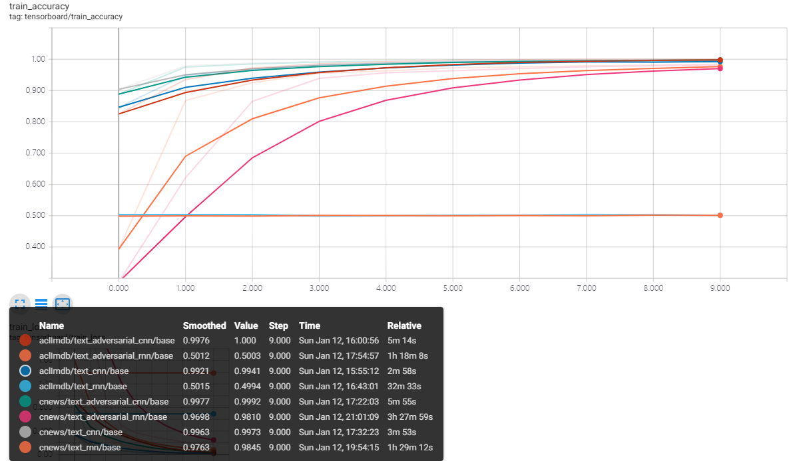
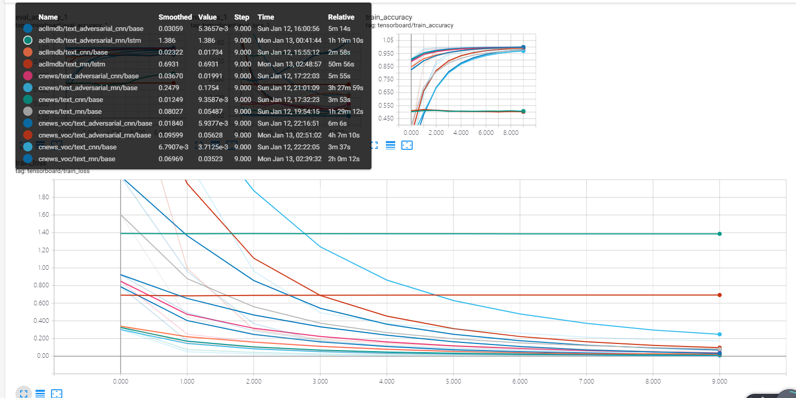
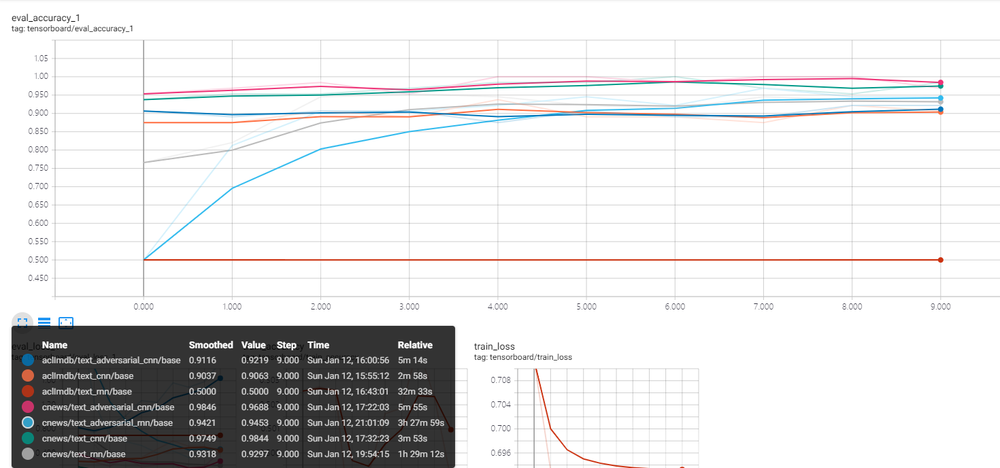
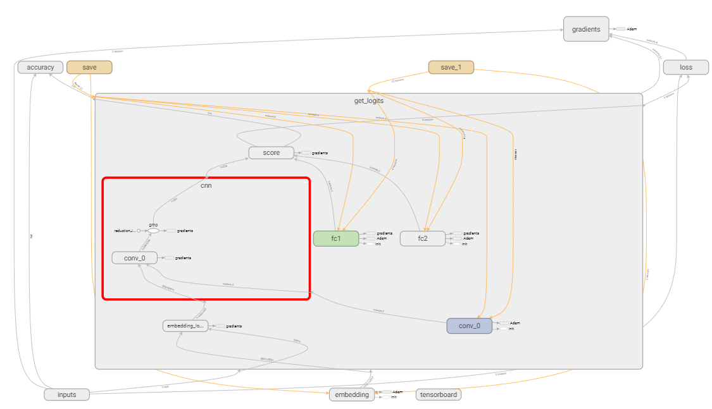
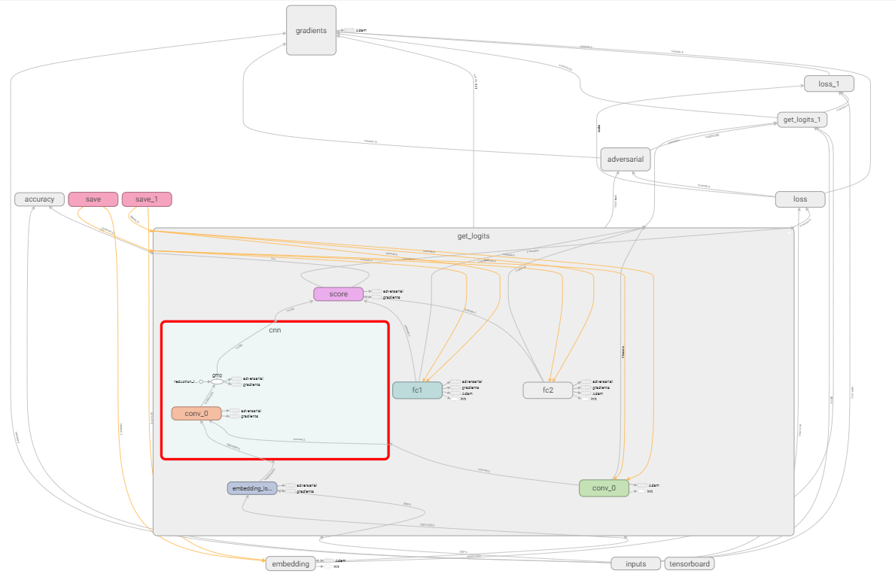
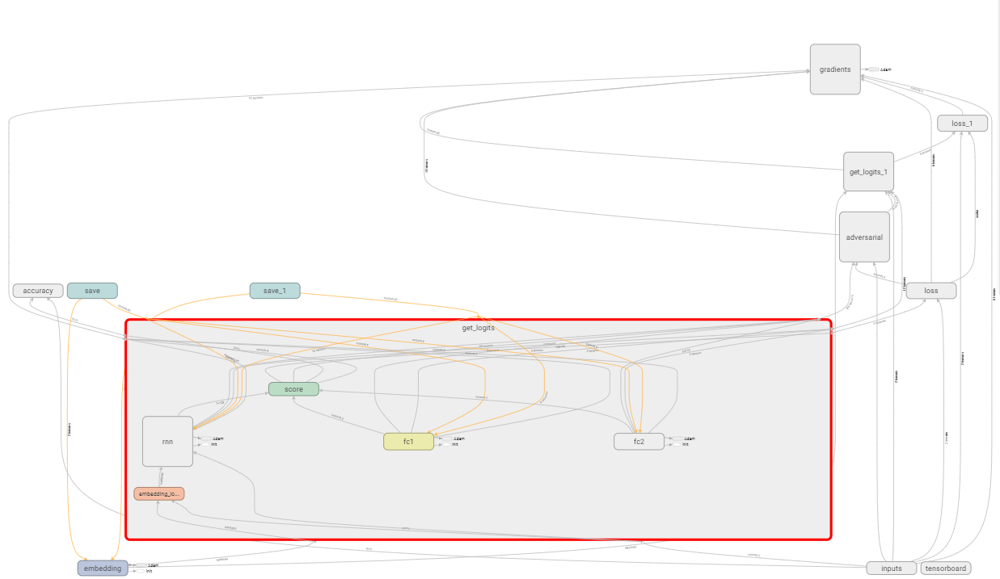
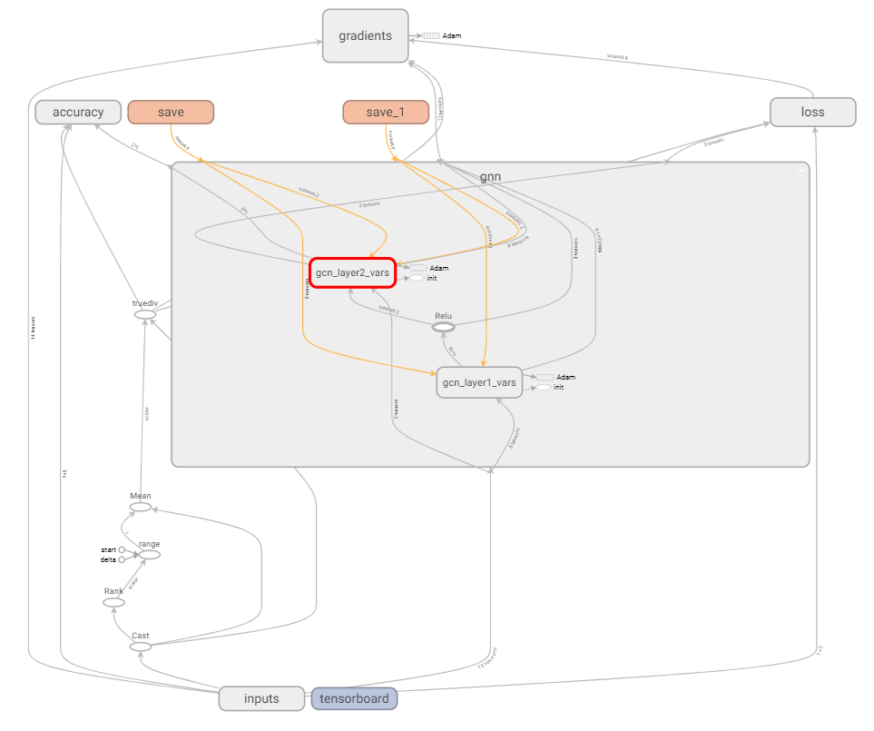

# text-classification
## 1.介绍
### 1.1 含义
本项目主要包含 文本分类的CNN,RNN,Adversarial Train和GNN的实现方式
### 1.2 环境安装
 ```
Python 3.6
tensorflow >= 1.12
numpy
pathlib
pyyaml
jieba
networkx
pickle
scikit-learn
```
### 2.2 项目框架
 ```
base_path
|
---_checkpoint # 存放训练生成的文件
|      |    data_name
|               |     model_name
|                        |    tag
|                              |    train # 存放训练的模型
|                              |    best # 存放最优的训练模型
|                              |    best_result.yaml # 用最优的模型测试下了的结果集合
|      |    ...
--- configs # 训练的参数文档
|     |    cnn  # 使用了cnn模型的参数集合
|     |    rnn  # 使用了rnn模型的参数集合
|     |    adversarial  # 使用了adversarial模型的参数集合
|     |    gnn  # 使用了gnn模型的参数集合
--- dataset # 处理过后的训练集
|     |    data_name
|     |    ...
--- scripts # 脚本
|     |    build_dataset.py # 将原始的数据 data ，处理后生成 dataset
|     |    ...
--- utils # 工具函数
|     |    ...
--- .gitignore # 忽视的内容
|
--- data_loader # 数据生成器
|     |    __init_.py  #_主要用来存放根据名字动态获取数据生成器的函数
|     |    data_generator.py  # 不同种类的数据加载类
|     |    ...
|
--- model  # 模型
|     |    __init_.py  #_主要用来存放根据名字动态获取模型类的函数
|     |    model.py  # 不同种类的模型类
|     |    ...
|
--- test.py # 测试类
|
--- train.py # 训练类
|
--- gnn_test.py # gnn专用测试类
|
--- gnn_train.py # gnn专用训练类
|
--- environment.text # 所有的环境
```
## 2.训练过程介绍
本项目把训练的过程拆分开来，主要是没办法一次性训练完。拆开保存中间结果可以更好的复现和调试代码。
### 2.1 创建数据集
#### 2.1.1 创建cnews数据集（cnn,rnn,adversarial的）
原数据地址:[cnews.txt](https://pan.baidu.com/s/1O1OmwHueRQ2DJ1TEa8sroQ)

网上查了一下，九年制义务教育好像要求大家都认识6600字。所以我的词典大小为7000(凑整数)

1.构建字典来翻译文本
```bash
python scripts/build_cn_dataset.py
```
预处理后的结果保存在dataset/cnews里面

这里的构建的数据集是以字为单位构建的字典。

**思考：** 
很多的内容其实并不是一个字表现出来的，比如鸡，可能构建成的词语有吃鸡，那么分类可能是游戏类，也可能构建成鸡你太美？那就变成娱乐类了。

**所以** 我还常识构建词典，以词典来翻译和训练。也许可以更快更准的找准分类。

2.构建词典来翻译文本
```bash
python scripts/build_cn_voc_dataset.py
```
预处理后的结果保存到dataset/cnews_voc里面。词典的大小也是7000
#### 2.1.2 创建aclImdb数据集
原数据地址:[aclImdb](https://pan.baidu.com/s/15MHl3pzndu5AaDYaL-T4jQ)

网上查了一下，美国年轻人好像要求都认识10000字左右？。所以我的词典大小为10000
```bash
python scripts/build_en_dataset.py
```
预处理后的结果保存到dataset/aclImdb里面。

**注意:** 之前的中文数据集由于不大，所以我就一次性放到一个文件里面了。而英文的数据集相对较大，所以我这里生成的训练和测试数据里面的input是地址。到训练的时候再读取内容进行翻译。(为了减少内存，不一次性全部处理了)
#### 2.1.3 创建GNN的aclImdb数据集
```bash
python scripts/build_gnn_en_dataset.py
```
**注意1:** gnn的数据集和我们平时做的数据集不同，都是些索引值和稀疏矩阵什么的。所以存储方式是二进制的。不便直接打开。

**注意2:** gnn构建英文数据集的速度非常慢，估计要**1到2小时** 
#### 2.1.4 创建GNN的cnews数据集
这里也分词典和字典两种
1.字典
```bash
python scripts/build_gnn_cn_dataset.py
```
预处理后的结果保存到dataset/cnews里面。
2.词典
```bash
python scripts/build_gnn_cn_voc_dataset.py
```
预处理后的结果保存到dataset/cnews_voc里面。
**注意1:** gnn构建中文数据集的速度非常慢，估计要**2到4小时** 
### 2.2 训练网络
#### 2.2.1 训练cnn,rnn,adversarial网络
```bash
python train.py
```
**注意:** rnn的网络相对来说要慢很多
##### 2.2.1.1 训练cnews数据
如果用字典作为翻译来训练中文数据，那么train.py里这样修改(具体其他参数都在config里提供了。)
```python
config = get_config('cnn/cnews')
# config = get_config('rnn/cnews')
# config = get_config('adversarial/cnews')
```

如果用词典来翻译训练，那么train.py里这样修改
```python 
config = get_config('cnn/cnews_voc')
# config = get_config('rnn/cnews_voc')
# config = get_config('adversarial/cnews_voc')
```
##### 2.2.1.2 训练aclimdb数据
train.py里这样修改
```python 
config = get_config('cnn/aclimdb')
# config = get_config('rnn/aclimdb')
# config = get_config('adversarial/aclimdb')
```
**注意:** rnn的aclimdb效果不好。还没找到原因
#### 2.2.2 训练gnn模型
```bash
python gnn_train.py
```
**注意:** 遇到报错:InvalidArgumentError (see above for traceback): Cannot use GPU when output.shape[1] * nnz(a) > 2^31

**解决方案:** 修改`configs/gnn/xxx.yaml`，把里面的`num_hidden`参数调小。或者把gpu换成cpu训练
```python
os.environ['CUDA_VISIBLE_DEVICES'] = '-1'
```
##### 2.2.2.1 训练cnews数据
1.字典:
```python 
config = get_config('gnn/cnews')
```
2.词典:
```python 
config = get_config('gnn/cnews_voc')
```
**注意:** 词典非常消耗显存很可能只有CPU才能训练
##### 2.2.2.2 训练aclimdb数据
```python 
config = get_config('gnn/aclImdb')
```
### 2.3 测试结果
#### 2.3.1 测试cnn,rnn,adversarial
注释掉test.py里不要测试的内容。
```python
# config = get_config('adversarial/aclImdb_rnn')
# config = get_config('adversarial/aclImdb_cnn')
# config = get_config('adversarial/cnews_rnn')
# config = get_config('adversarial/cnews_cnn')
# config = get_config('adversarial/cnews_voc_cnn')
# config = get_config('adversarial/cnews_voc_rnn')

# config = get_config('cnn/aclImdb')
# config = get_config('cnn/cnews')
# config = get_config('cnn/cnews_voc')
# config = get_config('rnn/aclImdb')
# config = get_config('rnn/cnews')
# config = get_config('rnn/cnews_voc')
```
然后执行下面的命令
```bash
python test.py
```
通过dataset_name,model_name,tag来定位一个模型参数的存放点
### 2.4 训练过程可视化
```bash
tensorboard --logdir=../tensorboard_logs
```
然后打开浏览器[https://localhost:6006](https://localhost:6006)
## 3.训练结果
### 3.1 训练后验证的结果
#### 3.1.1 中文数据集的结果
1.字典:

1.1 cnn: 
```
              precision    recall  f1-score   support

          体育       1.00      1.00      1.00       707
          娱乐       1.00      1.00      1.00       404
          家居       1.00      1.00      1.00       909
          房产       1.00      1.00      1.00       202
          教育       1.00      1.00      1.00       808
          时尚       1.00      1.00      1.00       808
          时政       1.00      1.00      1.00       606
          游戏       1.00      1.00      1.00       606
          科技       1.00      1.00      1.00      1111
          财经       1.00      1.00      1.00       303

    accuracy                           1.00      6464
   macro avg       1.00      1.00      1.00      6464
weighted avg       1.00      1.00      1.00      6464

混淆矩阵
[[ 707    0    0    0    0    0    0    0    0    0]
 [   0  404    0    0    0    0    0    0    0    0]
 [   0    0  909    0    0    0    0    0    0    0]
 [   0    0    0  202    0    0    0    0    0    0]
 [   0    0    0    0  808    0    0    0    0    0]
 [   0    0    0    0    0  808    0    0    0    0]
 [   0    0    0    0    0    0  606    0    0    0]
 [   0    0    0    0    0    0    0  606    0    0]
 [   0    0    0    0    0    0    0    0 1111    0]
 [   0    0    0    0    0    0    0    0    0  303]]
```
1.2 rnn: 
```
              precision    recall  f1-score   support

          体育       0.74      1.00      0.85       700
          娱乐       0.90      1.00      0.95       450
          家居       1.00      1.00      1.00       650
          房产       1.00      0.89      0.94       450
          教育       1.00      0.82      0.90       850
          时尚       1.00      1.00      1.00       900
          时政       0.89      0.80      0.84       500
          游戏       0.91      0.83      0.87       600
          科技       1.00      0.94      0.97       850
          财经       0.90      1.00      0.95       450

    accuracy                           0.93      6400
   macro avg       0.93      0.93      0.93      6400
weighted avg       0.94      0.93      0.93      6400

混淆矩阵
[[700   0   0   0   0   0   0   0   0   0]
 [  0 450   0   0   0   0   0   0   0   0]
 [  0   0 650   0   0   0   0   0   0   0]
 [ 50   0   0 400   0   0   0   0   0   0]
 [100   0   0   0 700   0   0  50   0   0]
 [  0   0   0   0   0 900   0   0   0   0]
 [ 50  50   0   0   0   0 400   0   0   0]
 [ 50   0   0   0   0   0   0 500   0  50]
 [  0   0   0   0   0   0  50   0 800   0]
 [  0   0   0   0   0   0   0   0   0 450]]
```
1.3 adversarial rnn: 
```
              precision    recall  f1-score   support

          体育       0.82      1.00      0.90       700
          娱乐       0.90      1.00      0.95       450
          家居       1.00      1.00      1.00       650
          房产       1.00      0.89      0.94       450
          教育       1.00      0.94      0.97       850
          时尚       0.95      1.00      0.97       900
          时政       0.90      0.90      0.90       500
          游戏       1.00      0.75      0.86       600
          科技       1.00      0.94      0.97       850
          财经       0.90      1.00      0.95       450

    accuracy                           0.95      6400
   macro avg       0.95      0.94      0.94      6400
weighted avg       0.95      0.95      0.94      6400

混淆矩阵
[[700   0   0   0   0   0   0   0   0   0]
 [  0 450   0   0   0   0   0   0   0   0]
 [  0   0 650   0   0   0   0   0   0   0]
 [ 50   0   0 400   0   0   0   0   0   0]
 [ 50   0   0   0 800   0   0   0   0   0]
 [  0   0   0   0   0 900   0   0   0   0]
 [  0   0   0   0   0  50 450   0   0   0]
 [ 50  50   0   0   0   0   0 450   0  50]
 [  0   0   0   0   0   0  50   0 800   0]
 [  0   0   0   0   0   0   0   0   0 450]]
```
1.4 adversarial cnn: 
```
              precision    recall  f1-score   support

          体育       1.00      1.00      1.00       707
          娱乐       1.00      1.00      1.00       404
          家居       1.00      1.00      1.00       909
          房产       1.00      1.00      1.00       202
          教育       1.00      1.00      1.00       808
          时尚       1.00      1.00      1.00       808
          时政       1.00      1.00      1.00       606
          游戏       1.00      1.00      1.00       606
          科技       1.00      1.00      1.00      1111
          财经       1.00      1.00      1.00       303

    accuracy                           1.00      6464
   macro avg       1.00      1.00      1.00      6464
weighted avg       1.00      1.00      1.00      6464

混淆矩阵
[[ 707    0    0    0    0    0    0    0    0    0]
 [   0  404    0    0    0    0    0    0    0    0]
 [   0    0  909    0    0    0    0    0    0    0]
 [   0    0    0  202    0    0    0    0    0    0]
 [   0    0    0    0  808    0    0    0    0    0]
 [   0    0    0    0    0  808    0    0    0    0]
 [   0    0    0    0    0    0  606    0    0    0]
 [   0    0    0    0    0    0    0  606    0    0]
 [   0    0    0    0    0    0    0    0 1111    0]
 [   0    0    0    0    0    0    0    0    0  303]]
```
1.5 gnn: 
```
              precision    recall  f1-score   support

          财经       0.87      0.81      0.84       637
          游戏       0.88      0.90      0.89       646
          时政       0.85      0.87      0.86       661
          娱乐       0.85      0.93      0.89       641
          科技       0.89      0.89      0.89       673
          体育       0.97      0.96      0.96       660
          房产       0.76      0.79      0.78       660
          家居       0.86      0.74      0.80       644
          教育       0.81      0.83      0.82       631
          时尚       0.88      0.90      0.89       647

    accuracy                           0.86      6500
   macro avg       0.86      0.86      0.86      6500
weighted avg       0.86      0.86      0.86      6500

混淆矩阵
[[513   0  17   9   3   1  68  12  14   0]
 [  1 582   2  13  12   1   0   2  29   4]
 [  6   6 578   9   8   4  27   3  20   0]
 [  2  16   3 594   6   6   1   1   4   8]
 [  0  19   7   3 599   6   4  12  21   2]
 [  1   8   4  11   3 631   0   0   1   1]
 [ 57   1  41   3   0   0 519  28  11   0]
 [  1   2  12  28  10   0  47 477  11  56]
 [  7  18  16   9  29   2   7   7 526  10]
 [  0   8   1  19   2   2   6  13  13 583]]
```
2.词典:
2.1 cnn: 
```
              precision    recall  f1-score   support

          体育       1.00      1.00      1.00       303
          娱乐       1.00      1.00      1.00      1010
          家居       1.00      1.00      1.00       505
          房产       1.00      1.00      1.00       606
          教育       1.00      1.00      1.00       606
          时尚       1.00      1.00      1.00       505
          时政       1.00      1.00      1.00       909
          游戏       1.00      1.00      1.00      1010
          科技       1.00      1.00      1.00       404
          财经       1.00      1.00      1.00       606

    accuracy                           1.00      6464
   macro avg       1.00      1.00      1.00      6464
weighted avg       1.00      1.00      1.00      6464

混淆矩阵
[[ 303    0    0    0    0    0    0    0    0    0]
 [   0 1010    0    0    0    0    0    0    0    0]
 [   0    0  505    0    0    0    0    0    0    0]
 [   0    0    0  606    0    0    0    0    0    0]
 [   0    0    0    0  606    0    0    0    0    0]
 [   0    0    0    0    0  505    0    0    0    0]
 [   0    0    0    0    0    0  909    0    0    0]
 [   0    0    0    0    0    0    0 1010    0    0]
 [   0    0    0    0    0    0    0    0  404    0]
 [   0    0    0    0    0    0    0    0    0  606]]
```
2.2 rnn: 
```
              precision    recall  f1-score   support

          体育       1.00      1.00      1.00       350
          娱乐       1.00      1.00      1.00       900
          家居       0.90      0.90      0.90       500
          房产       1.00      0.94      0.97       800
          教育       1.00      1.00      1.00       450
          时尚       0.93      1.00      0.97       700
          时政       0.94      1.00      0.97       850
          游戏       0.93      0.88      0.90       800
          科技       0.88      1.00      0.93       350
          财经       1.00      0.93      0.96       700

    accuracy                           0.96      6400
   macro avg       0.96      0.96      0.96      6400
weighted avg       0.96      0.96      0.96      6400

混淆矩阵
[[350   0   0   0   0   0   0   0   0   0]
 [  0 900   0   0   0   0   0   0   0   0]
 [  0   0 450   0   0   0   0  50   0   0]
 [  0   0   0 750   0   0   0   0  50   0]
 [  0   0   0   0 450   0   0   0   0   0]
 [  0   0   0   0   0 700   0   0   0   0]
 [  0   0   0   0   0   0 850   0   0   0]
 [  0   0  50   0   0   0  50 700   0   0]
 [  0   0   0   0   0   0   0   0 350   0]
 [  0   0   0   0   0  50   0   0   0 650]]
```
2.3 adversarial cnn: 
```
              precision    recall  f1-score   support

          体育       1.00      1.00      1.00       303
          娱乐       1.00      1.00      1.00      1010
          家居       1.00      1.00      1.00       505
          房产       1.00      1.00      1.00       606
          教育       1.00      1.00      1.00       606
          时尚       1.00      1.00      1.00       505
          时政       1.00      1.00      1.00       909
          游戏       1.00      1.00      1.00      1010
          科技       1.00      1.00      1.00       404
          财经       1.00      1.00      1.00       606

    accuracy                           1.00      6464
   macro avg       1.00      1.00      1.00      6464
weighted avg       1.00      1.00      1.00      6464

混淆矩阵
[[ 303    0    0    0    0    0    0    0    0    0]
 [   0 1010    0    0    0    0    0    0    0    0]
 [   0    0  505    0    0    0    0    0    0    0]
 [   0    0    0  606    0    0    0    0    0    0]
 [   0    0    0    0  606    0    0    0    0    0]
 [   0    0    0    0    0  505    0    0    0    0]
 [   0    0    0    0    0    0  909    0    0    0]
 [   0    0    0    0    0    0    0 1010    0    0]
 [   0    0    0    0    0    0    0    0  404    0]
 [   0    0    0    0    0    0    0    0    0  606]]
```
2.4 adversarial rnn: 
```
              precision    recall  f1-score   support

          体育       1.00      1.00      1.00       350
          娱乐       1.00      1.00      1.00       900
          家居       1.00      1.00      1.00       500
          房产       1.00      1.00      1.00       800
          教育       1.00      1.00      1.00       450
          时尚       1.00      1.00      1.00       700
          时政       0.94      1.00      0.97       850
          游戏       1.00      0.94      0.97       800
          科技       1.00      1.00      1.00       350
          财经       1.00      1.00      1.00       700

    accuracy                           0.99      6400
   macro avg       0.99      0.99      0.99      6400
weighted avg       0.99      0.99      0.99      6400

混淆矩阵
[[350   0   0   0   0   0   0   0   0   0]
 [  0 900   0   0   0   0   0   0   0   0]
 [  0   0 500   0   0   0   0   0   0   0]
 [  0   0   0 800   0   0   0   0   0   0]
 [  0   0   0   0 450   0   0   0   0   0]
 [  0   0   0   0   0 700   0   0   0   0]
 [  0   0   0   0   0   0 850   0   0   0]
 [  0   0   0   0   0   0  50 750   0   0]
 [  0   0   0   0   0   0   0   0 350   0]
 [  0   0   0   0   0   0   0   0   0 700]]
```
2.5 gnn: 
```

```
#### 3.1.2 英文数据集的结果
1.cnn: 
```
              precision    recall  f1-score   support

         neg       0.96      0.81      0.88      1248
         pos       0.84      0.97      0.90      1248

    accuracy                           0.89      2496
   macro avg       0.90      0.89      0.89      2496
weighted avg       0.90      0.89      0.89      2496

混淆矩阵
[[1014  234]
 [  39 1209]]
```
2.rnn: 
```
  'precision', 'predicted', average, warn_for)
              precision    recall  f1-score   support

         neg       0.50      1.00      0.67      1248
         pos       0.00      0.00      0.00      1248

    accuracy                           0.50      2496
   macro avg       0.25      0.50      0.33      2496
weighted avg       0.25      0.50      0.33      2496

混淆矩阵
[[1248    0]
 [1248    0]]
```
3.adversarial cnn: 
```
              precision    recall  f1-score   support

         neg       0.97      0.88      0.92      1248
         pos       0.89      0.97      0.93      1248

    accuracy                           0.92      2496
   macro avg       0.93      0.92      0.92      2496
weighted avg       0.93      0.92      0.92      2496

混淆矩阵
[[1092  156]
 [  39 1209]]
```
4.adversarial rnn: 
```
              precision    recall  f1-score   support

         neg       0.63      0.75      0.69      1248
         pos       0.69      0.56      0.62      1248

    accuracy                           0.66      2496
   macro avg       0.66      0.66      0.65      2496
weighted avg       0.66      0.66      0.65      2496

混淆矩阵
[[936 312]
 [546 702]]
```
5.gnn: 
```
              precision    recall  f1-score   support

         neg       0.91      0.90      0.91      1252
         pos       0.90      0.91      0.91      1248

    accuracy                           0.91      2500
   macro avg       0.91      0.91      0.91      2500
weighted avg       0.91      0.91      0.91      2500

混淆矩阵
[[1130  122]
 [ 114 1134]]
```
### 3.2 训练可视化的结果
#### 3.2.1 训练集的精确度

#### 3.2.2 训练集的loss

#### 3.2.3 验证集的精确度

#### 3.2.4 验证集的loss

#### 3.2.5 cnn网络架构

#### 3.2.6 rnn网络架构

#### 3.2.7 adversarial cnn网络架构

#### 3.2.8 adversarial rnn网络架构

#### 3.2.9 gnn 网络架构


## 4.参考
1. [代码:CNN-RNN中文文本分类](https://github.com/gaussic/text-classification-cnn-rnn)
2. [adversarial loss tensorflow的官方实现方式](https://github.com/tensorflow/models/tree/master/research/adversarial_text)
3. [adversarial loss 其他人的实现方式](https://github.com/enry12/adversarial_training_methods)
4. [adversarial loss 多任务的文本分类](https://github.com/FrankWork/fudan_mtl_reviews)
5. [Graph Convolutional Networks for Text Classification. AAAI 2019的代码实现](https://github.com/yao8839836/text_gcn)
6. [GNN tensorflow和pytorch的实现(不包含构建数据集)](https://github.com/svjan5/GNNs-for-NLP)

# TODO：
1. 优化结构 cnn,rnn,adversarial build_dataset的代码，用list数组代替正反数据的yaml(减少时间和空间的消耗)
2. 改良rnn在aclImdb上的结果。