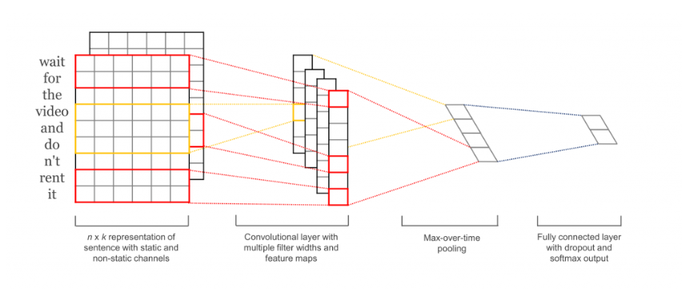
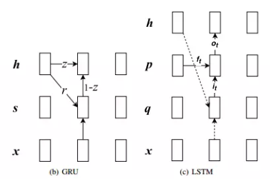
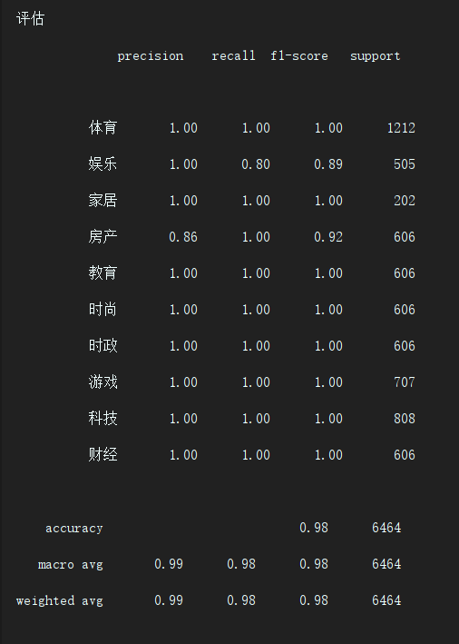
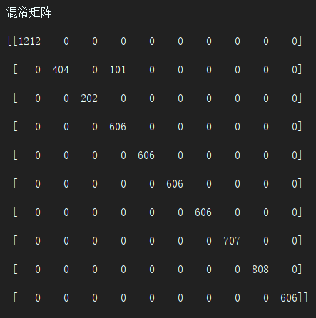
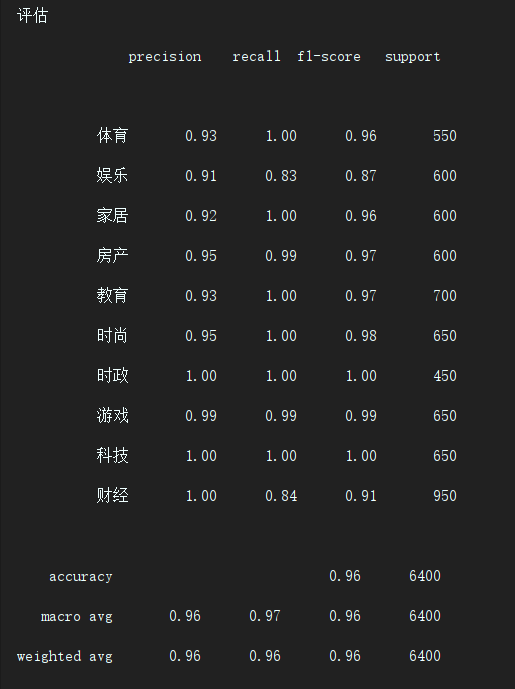
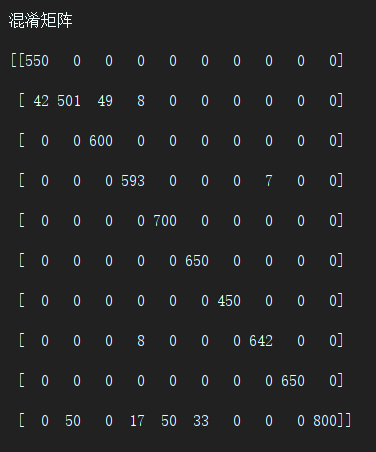

# text-classification-cnn
## 1.介绍
### 1.1 含义
本项目主要包含 文本分类的CNN和RNN实现方式
### 1.2 模型介绍
输入的大小是统一的，长度不够的就```<PAD>```，长度超过的就裁剪，
1. cnn



2. rnn



## 2.训练过程介绍
### 2.1 环境安装
 ```yaml
 # environment.yaml
Python Environment: 3.6
tensorflow: 1.12
jieba
numpy
pathlib
pyyaml
```
### 2.2 项目框架
 ```angular2
base_path
|
---_checkpoint # 存放训练生成的文件
|      |    data_name
|               |     model_name
|                        |    tag
|                              |    train # 存放训练的模型
|                              |    best # 存放最优的训练模型
|                              |    best_result.yaml # 用最优的模型测试下了的结果集合
|      |    ...
--- configs # 训练的参数文档
|     |    cnn  # 使用了cnn模型的参数集合
|     |    rnn  # 使用了rnn模型的参数集合
--- data # 原始的训练集
|     |    data_name.txt
|     |    ...
--- dataset # 处理过后的训练集
|     |    data_name
|              |    data.yaml # 机器要学习的文本
|              |    dictionary.tsv # 字典
|              |    info.yaml
|              |    reverse_dictionary.yaml # 反向字典
|     |    ...
--- scripts # 脚本
|     |    build_dataset.py # 将原始的数据 data ，处理后生成 dataset
|     |    ...
--- utils # 工具函数
|     |    ...
--- .gitignore # 忽视的内容
|
--- data_loader # 数据生成器
|     |    __init_.py  #_主要用来存放根据名字动态获取数据生成器的函数
|     |    data_generator.py  # 不同种类的数据加载类
|     |    ...
|
--- model  # 模型
|     |    __init_.py  #_主要用来存放根据名字动态获取模型类的函数
|     |    model.py  # 不同种类的模型类
|     |    ...
|
--- test.py # 测试类
|
--- train.py # 训练类
|
--- environment.yaml # 所有的环境
```
### 2.3 训练过程
本项目把训练的过程拆分开来，主要是没办法一次性训练完。拆开保存中间结果可以更好的复现和调试代码。
#### 2.3.1 创建数据集
##### 2.3.1.1 创建中文数据集
网上查了一下，九年制义务教育好像要求大家都认识6600字。所以我的词典大小为7000(凑整数)
1. 构建字典来翻译文本
```bash
python scripts/build_cn_dataset.py
```
利用原数据data/cnews/cnews.txt()，预处理，并把预处理后的结果保存到dataset/cnews里面
这里的构建的数据集是以字为单位构建的字典。

**思考** 很多的内容其实并不是一个字表现出来的，比如鸡，可能构建成的词语有吃鸡，那么分类可能是游戏类，也可能构建成鸡你太美？那就变成娱乐类了。

**所以** 我还常识构建词典，以词典来翻译和训练。也许可以更快更准的找准分类。

2. 构建词典来翻译文本
```bash
python scripts/build_cn_voc_dataset.py
```
利用原数据data/cnews/[cnews.txt](https://pan.baidu.com/s/1O1OmwHueRQ2DJ1TEa8sroQ)，预处理，并把预处理后的结果保存到dataset/cnews_voc里面。词典的大小也是7000
##### 2.3.1.2 创建英文数据集
网上查了一下，美国年轻人好像要求都认识10000字左右？。所以我的词典大小为10000
```bash
python scripts/build_en_dataset.py
```
利用原数据data/[aclImdb](https://pan.baidu.com/s/15MHl3pzndu5AaDYaL-T4jQ)，预处理，并把预处理后的结果保存到dataset/aclImdb里面。
这里注意，之前的中文数据集由于不大，所以我就一次性晒到一个文件里面了。
而英文的数据集相对较大，所以我这里生成的训练和测试数据里面的input是地址。到训练的时候再读取内容进行翻译。(为了减少内存，不一次性全部处理了)
#### 2.3.2 训练网络
train.py里面运行的那一段就是这样的
```python
if __name__ == '__main__':
    config = get_config('cnn/cnews')
    config['tag'] = 'base'
    train(config)
```
然后直接运行这个命令就可以训练了。
```bash
python train.py
```
##### 2.3.2.1 训练中文数据
如果用字典作为翻译来训练中文数据，那么train.py里这样写就好了。具体其他参数都在config里提供了
```python
config = get_config('cnn/cnews')
```
如果用词典来翻译训练，就换成cnews_voc。
```python 
config = get_config('cnn/cnews_voc')
```
##### 2.3.2.2 训练英文数据
这里把cnews换成aclimdb就好了
```python 
config = get_config('cnn/aclimdb')
```
##### 2.3.2.3 训练cnn模型
注意这里获取的是cnn下的配置文件就好了。
```python 
config = get_config('cnn/cnews')
```
##### 2.3.2.3 训练rnn模型
注意这里获取的是rnn下的配置文件就好了。
```python 
config = get_config('rnn/cnews')
```
我这里顺便还训练了下 num_layers为3的情况的的结果。猜测序列越长也许效果会更好点。
```python 
config = get_config('rnn/cnews')
config['tag'] = 'cell_3'
config['model']['num_layers'] = 3
```
#### 2.3.3 测试结果
```bash
python test.py
```
其他的雷同train.py。用什么配置文件训练的网络，再用什么配置文件去测试就好了。
通过dataset_name,model_name,tag来定位一个模型参数的存放点
#### 2.4 训练过程可视化
```bash
tensorboard --logdir=../tensorboard_logs
```
然后打开浏览器[https://localhost:6006](https://localhost:6006)
## 3.训练结果
### 3.1 训练后验证的结果
#### 3.1.1 中文数据集的结果
1. 字典:

1.1 cnn: 

```
              precision    recall  f1-score   support

          体育       1.00      1.00      1.00       707
          娱乐       1.00      1.00      1.00       404
          家居       1.00      1.00      1.00       909
          房产       1.00      1.00      1.00       202
          教育       1.00      1.00      1.00       808
          时尚       1.00      1.00      1.00       808
          时政       1.00      1.00      1.00       606
          游戏       1.00      1.00      1.00       606
          科技       1.00      1.00      1.00      1111
          财经       1.00      1.00      1.00       303

    accuracy                           1.00      6464
   macro avg       1.00      1.00      1.00      6464
weighted avg       1.00      1.00      1.00      6464

混淆矩阵
[[ 707    0    0    0    0    0    0    0    0    0]
 [   0  404    0    0    0    0    0    0    0    0]
 [   0    0  909    0    0    0    0    0    0    0]
 [   0    0    0  202    0    0    0    0    0    0]
 [   0    0    0    0  808    0    0    0    0    0]
 [   0    0    0    0    0  808    0    0    0    0]
 [   0    0    0    0    0    0  606    0    0    0]
 [   0    0    0    0    0    0    0  606    0    0]
 [   0    0    0    0    0    0    0    0 1111    0]
 [   0    0    0    0    0    0    0    0    0  303]]
```

1.2 rnn: 

```
              precision    recall  f1-score   support

          体育       0.74      1.00      0.85       700
          娱乐       0.90      1.00      0.95       450
          家居       1.00      1.00      1.00       650
          房产       1.00      0.89      0.94       450
          教育       1.00      0.82      0.90       850
          时尚       1.00      1.00      1.00       900
          时政       0.89      0.80      0.84       500
          游戏       0.91      0.83      0.87       600
          科技       1.00      0.94      0.97       850
          财经       0.90      1.00      0.95       450

    accuracy                           0.93      6400
   macro avg       0.93      0.93      0.93      6400
weighted avg       0.94      0.93      0.93      6400

混淆矩阵
[[700   0   0   0   0   0   0   0   0   0]
 [  0 450   0   0   0   0   0   0   0   0]
 [  0   0 650   0   0   0   0   0   0   0]
 [ 50   0   0 400   0   0   0   0   0   0]
 [100   0   0   0 700   0   0  50   0   0]
 [  0   0   0   0   0 900   0   0   0   0]
 [ 50  50   0   0   0   0 400   0   0   0]
 [ 50   0   0   0   0   0   0 500   0  50]
 [  0   0   0   0   0   0  50   0 800   0]
 [  0   0   0   0   0   0   0   0   0 450]]
```

1.3 adversarial rnn: 

```
              precision    recall  f1-score   support

          体育       0.82      1.00      0.90       700
          娱乐       0.90      1.00      0.95       450
          家居       1.00      1.00      1.00       650
          房产       1.00      0.89      0.94       450
          教育       1.00      0.94      0.97       850
          时尚       0.95      1.00      0.97       900
          时政       0.90      0.90      0.90       500
          游戏       1.00      0.75      0.86       600
          科技       1.00      0.94      0.97       850
          财经       0.90      1.00      0.95       450

    accuracy                           0.95      6400
   macro avg       0.95      0.94      0.94      6400
weighted avg       0.95      0.95      0.94      6400

混淆矩阵
[[700   0   0   0   0   0   0   0   0   0]
 [  0 450   0   0   0   0   0   0   0   0]
 [  0   0 650   0   0   0   0   0   0   0]
 [ 50   0   0 400   0   0   0   0   0   0]
 [ 50   0   0   0 800   0   0   0   0   0]
 [  0   0   0   0   0 900   0   0   0   0]
 [  0   0   0   0   0  50 450   0   0   0]
 [ 50  50   0   0   0   0   0 450   0  50]
 [  0   0   0   0   0   0  50   0 800   0]
 [  0   0   0   0   0   0   0   0   0 450]]
```

1.4 adversarial cnn: 

```
              precision    recall  f1-score   support

          体育       1.00      1.00      1.00       707
          娱乐       1.00      1.00      1.00       404
          家居       1.00      1.00      1.00       909
          房产       1.00      1.00      1.00       202
          教育       1.00      1.00      1.00       808
          时尚       1.00      1.00      1.00       808
          时政       1.00      1.00      1.00       606
          游戏       1.00      1.00      1.00       606
          科技       1.00      1.00      1.00      1111
          财经       1.00      1.00      1.00       303

    accuracy                           1.00      6464
   macro avg       1.00      1.00      1.00      6464
weighted avg       1.00      1.00      1.00      6464

混淆矩阵
[[ 707    0    0    0    0    0    0    0    0    0]
 [   0  404    0    0    0    0    0    0    0    0]
 [   0    0  909    0    0    0    0    0    0    0]
 [   0    0    0  202    0    0    0    0    0    0]
 [   0    0    0    0  808    0    0    0    0    0]
 [   0    0    0    0    0  808    0    0    0    0]
 [   0    0    0    0    0    0  606    0    0    0]
 [   0    0    0    0    0    0    0  606    0    0]
 [   0    0    0    0    0    0    0    0 1111    0]
 [   0    0    0    0    0    0    0    0    0  303]]
```

2. 词典:

2.1 cnn: 





2.2 rnn: 





2.3 adversarial cnn: 


2.4 adversarial rnn: 


#### 3.1.2 英文数据集的结果
1. cnn: 

```
              precision    recall  f1-score   support

         neg       0.96      0.81      0.88      1248
         pos       0.84      0.97      0.90      1248

    accuracy                           0.89      2496
   macro avg       0.90      0.89      0.89      2496
weighted avg       0.90      0.89      0.89      2496

混淆矩阵
[[1014  234]
 [  39 1209]]
```

2. rnn: 

```
  'precision', 'predicted', average, warn_for)
              precision    recall  f1-score   support

         neg       0.50      1.00      0.67      1248
         pos       0.00      0.00      0.00      1248

    accuracy                           0.50      2496
   macro avg       0.25      0.50      0.33      2496
weighted avg       0.25      0.50      0.33      2496

混淆矩阵
[[1248    0]
 [1248    0]]
```

3. adversarial cnn: 
```
              precision    recall  f1-score   support

         neg       0.97      0.88      0.92      1248
         pos       0.89      0.97      0.93      1248

    accuracy                           0.92      2496
   macro avg       0.93      0.92      0.92      2496
weighted avg       0.93      0.92      0.92      2496

混淆矩阵
[[1092  156]
 [  39 1209]]
```

4. adversarial rnn: 
```
  'precision', 'predicted', average, warn_for)
              precision    recall  f1-score   support

         neg       0.00      0.00      0.00      1248
         pos       0.50      1.00      0.67      1248

    accuracy                           0.50      2496
   macro avg       0.25      0.50      0.33      2496
weighted avg       0.25      0.50      0.33      2496

混淆矩阵
[[   0 1248]
 [   0 1248]]
```

### 3.2 训练可视化的结果
#### 3.2.1 训练集的精确度

#### 3.2.2 训练集的loss

#### 3.2.3 验证集的精确度

#### 3.2.4 验证集的loss

#### 3.2.5 cnn网络架构

#### 3.2.5 rnn网络架构

#### 3.2.5 adversarial cnn网络架构

#### 3.2.5 adversarial rnn网络架构

## 4.参考
1. [代码:CNN-RNN中文文本分类](https://github.com/gaussic/text-classification-cnn-rnn)
